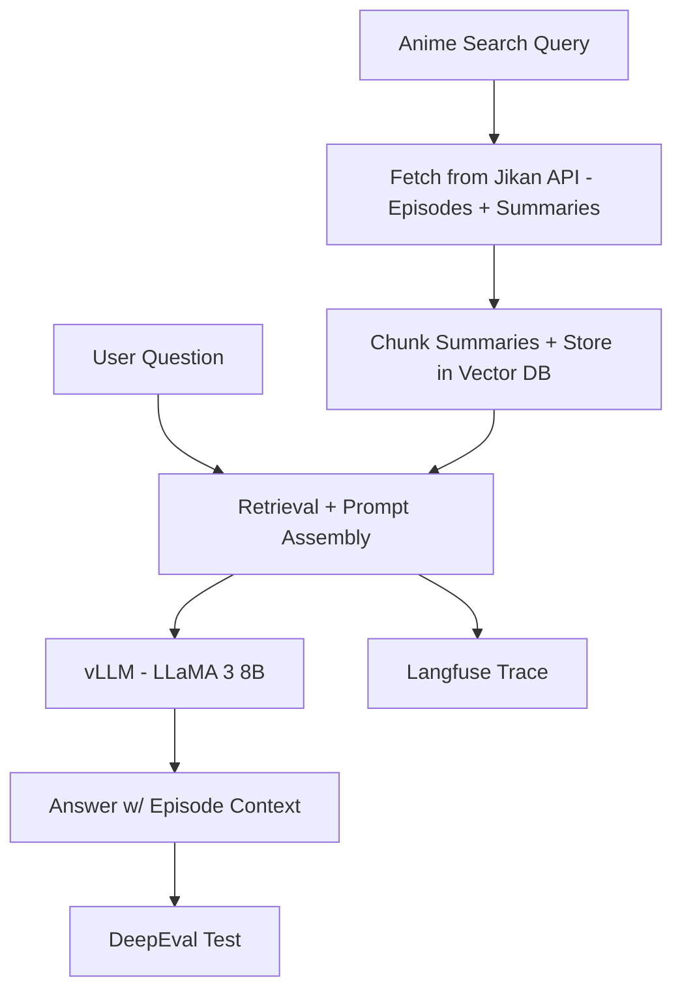

# 📚 Anime RAG Assistant — Project Plan (MVP)

A FastAPI + Gradio-powered chatbot that uses a local LLaMA3 8B model and RAG over subtitle & episode summaries from popular anime series.

---

## ✅ MVP Goals

| Goal | Description |
|------|-------------|
| 🔍 Ask Qs about anime | Answer episode-level questions via RAG over SRT/summary |
| 📄 Chunk subtitles + metadata | Use LlamaIndex for ingest + retrieval |
| 💬 Stream responses | Serve via vLLM (LLaMA3 8B, OpenAI-compatible) |
| 🧪 Eval output quality | Use [DeepEval](https://github.com/confident-ai/deepeval) (an open-source LLM evaluation framework) + some manual tests |
| 🧠 Trace everything | [Langfuse](https://github.com/langfuse/langfuse) (an open-source LLM observability and evaluation platform) integration for traces, latency, prompt versions |
| 🖥️ Interfaces | Swagger docs + Gradio UI for chat/testing |

---

## 🧱 Project Phases

### 🔹 Phase 1 — Data Ingestion & Indexing
- Subtitle/Summary preprocessor: custom parser for `.srt`, `.md`, `.txt`
- Chunking & metadata with `LlamaIndex` (episode ID, speaker, timestamp)
- Use Chroma (local) for persistence

### 🔹 Phase 2 — RAG QA Chain
- Use `LlamaIndex` retriever (dense or hybrid)
- Serve LLaMA3 8B via `vLLM`
- Langfuse tags for model + prompt versioning

### 🔹 Phase 3 — API & UI Integration
- FastAPI backend with `/chat`, `/search`, `/healthz`, `/meta`
- Swagger auto-generated docs
- Gradio UI for testing chat + feedback

### 🔹 Phase 4 — Evaluation
- Add `DeepEval` test cases with `LLMTestCase`
- Manual grading via JSON/YAML test set
- (Optional) `Ragas` for document-grounded eval

### 🔹 Phase 5 — Observability
- Langfuse for full trace logging (input/output/context)
- Tags: episode, model, latency, chunk count
- User feedback (👍/👎) via Langfuse or local DB

---

## 🧱 Directory Structure

```bash
anime_assistant/
├── src/
│   ├── server.py          # FastAPI entrypoint
│   ├── ingest.py          # Subtitle/summary parser → index
│   ├── retriever.py       # LlamaIndex retriever setup
│   ├── rag_chain.py       # LangChain RAG chain
│   ├── models.py          # Pydantic schemas
│   ├── langfuse_hook.py   # Langfuse instrumentation
│   ├── gradio_ui.py       # Optional UI
│   └── settings.py        # Central settings
├── data/
│   ├── raw/
│   ├── metadata/          # episode info
│   └── index/             # LlamaIndex persist dir
├── tests/
│   ├── test_eval_deepeval.py
│   └── qa_cases.json      # manual eval set
├── Dockerfile
├── docker-compose.yml
├── requirements.txt
├── requirements-dev.txt
├── setup.cfg
└── README.md
```

---


